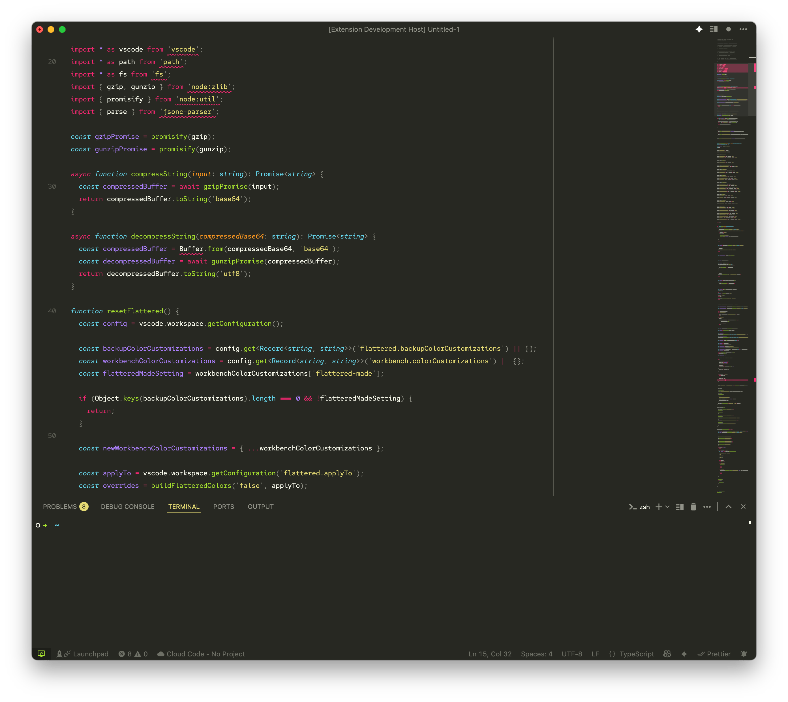

# Flattered

👋 A VS Code extension that makes your editor look **flat, tidy, modern, and minimal**. This is not a theme, but a "theme overrider" or "theme flattener" so to speak. If you’ve ever liked a color theme's look in the editor but wished for a cleaner, flatter overall look — Flattered has you covered.

---

## ⚠︎ ️Important Warnings ⚠︎

### 1. This extension touches your `workbench.colorCustomizations`
Flattered works by applying overrides to VS Code’s `workbench.colorCustomizations` setting.
- If you have custom tweaks or **commented-out properties** in this section of the settings, they may be lost.
- Please **back up your settings** before installing Flattered.

If you don’t mess with workbench.customizations, you’re safe to ignore this.

### 2. Themes may look "weird" with Flattered enabled
When Flattered is active, previewing out other themes might not look as expected because overrides are still applied.
To see a theme in its original form, use the **Reset Current Theme** command to remove overrides first. Unfortunately at the time of publish, there isn't a VS Code API event to automate this. Hopefully in the future.

---

## Features

- Apply a **flat and minimal style** on top of any theme.
- Works with your favorite color themes without replacing them.
- Toggle and reset easily from the command palette.

### Preview

**Before Flattered**

**After Flattered**

**After more minimal customizations**

---

## Requirements

No additional dependencies — just VS Code.

---

## Extension Settings

This extension contributes the following setting:

- `flattered.enabled`
Enable Flattered.
- `flattered.autoApply`
Enable automatic apply Flattered on theme change, workbench.colorCustomizations, or Flatter setting change.
- `flattered.customColor`
Custom color (hex) to use. Leave blank to use editor background color.
- `flattered.applyTo.titleBar`
Apply Flattered color to title bar
- `flattered.applyTo.tabs`
Apply Flattered color to editor tabs
- `flattered.applyTo.activityBar`
Apply Flattered color to activity bar"
- `flattered.applyTo.sideBar`
Apply Flattered color to sidebar
- `flattered.applyTo.panel`
Apply Flattered color to bottom panel
- `flattered.applyTo.terminal`
Apply Flattered color to integrated terminal
- `flattered.applyTo.statusBar`
Apply Flattered color to status bar
- `flattered.applyTo.borders`
Also apply on related borders
- `flattered.backupColorCustomizations`
This isn't a setting per se, but a storage of previous workbench color customizations that Flattered have overriden, used later when `Reset Current Theme` command is invoked.
### Commands
- To manually apply Flattered to your current theme:
`Flattered: Apply to Current Theme`
- To reset Flattered at any time, via the Command Palette:
`Flattered: Reset Current Theme`

---

## Known Issues

- Manual user's overrides in `workbench.colorCustomizations` may get wiped out once overrides are applied.
- Some themes doesn't seem to be compatible with this, i.e. can find where their theme files are located (e.g. "Best Themes Redefined"). Still investigating why.

---

## Release Notes

### 1.1.0
- Support for title bar background color as source color
- Support for applying to
  - sidebar section header background
  - minimap background
- Change setting for Auto Apply to
  - false
  - true (Always when color theme or a Flattered setting has been changed)
  - "ask"

### 1.0.2
- Compressed `flattered-made` setting.

### 1.0.1
- Fix an issue where the configuration is being mistakenly backed up leading to failed reset 🤦🏼

### 1.0.0
- Initial release of Flattered 🎉
- Adds flat overrides to your current theme.
- Includes reset command for safely reverting changes.

---

## For An Even More Minimal Look (bias)
- Hide the Activity Bar, much faster to use keyboard shortcuts
`"workbench.activityBar.location": "hidden"`
- Hide the Command Center, there's already the command pallete
`"window.commandCenter": false`
- Hide the Tab Bar, much faster to use ctrl+tab
`"workbench.editor.showTabs": "none"`
- Hide the Bread Crumbs, much faster to use cmd+o to go to identifiers
`"breadcrumbs.enabled": false`
- Show line numbers at intervals instead of each line, less distraction, ctrl+G to go to specific line
`"editor.lineNumbers": "interval"`
- Play around find fonts, ligatures and alt sets, and line heights, for better readability. My gotos are
  - LigaSrc Pro
  - Red Hat Mono *(I ligaturized one)*
  - Consolas
  - Cascadia
  - Jet Brains Mono
  - Fira Code
  - Ligconsolata
  - Anonymous Pro
  - `"editor.letterSpacing": -0.1`
  - `"editor.fontSize": 13`
  - `"editor.lineHeight": 1.8`
---

## Roadmap
- More commands
  - Change each of the Flattered setting

**I hope you enjoy a flatter VS Code!**

-Wil, wagulo at gmail
